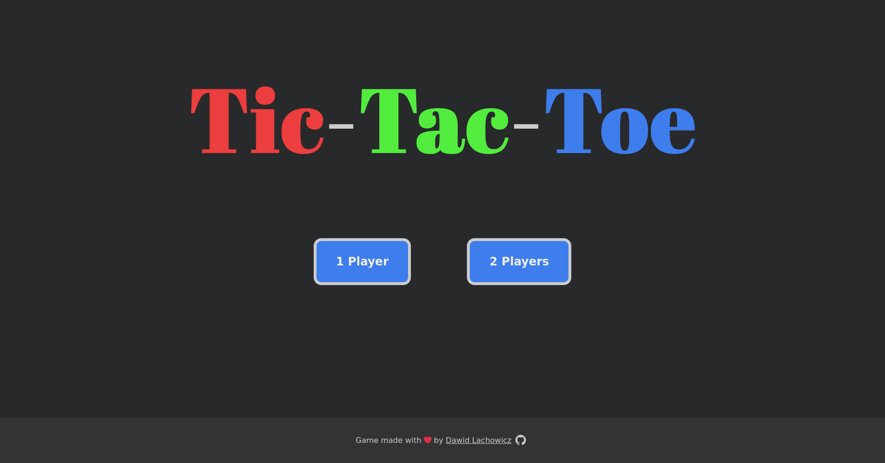
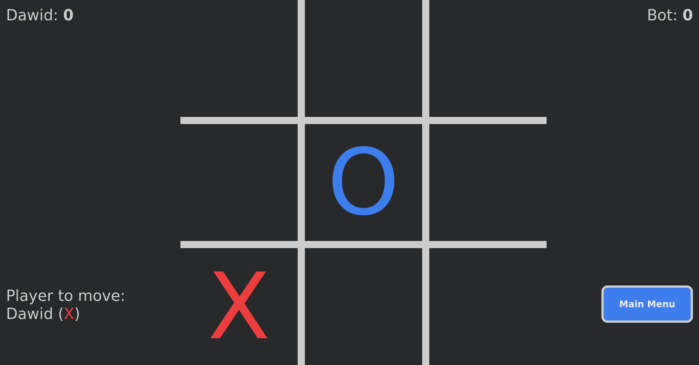
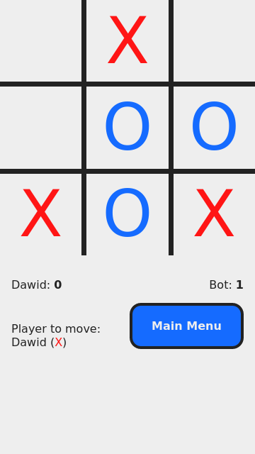

# Tic Tac Toe

## JavaScript course - The Odin Project

Project for getting started with factory functions and the module pattern in
JavaScript by creating a simple Tic-Tac-Toe game.

[Project: Tic Tac Toe](https://www.theodinproject.com/lessons/javascript-tic-tac-toe)
is part of [The Odin Project](https://www.theodinproject.com/) curriculum.

## About the Application

The classical Tic-Tac-Toe game. Play with a friend in 2 Players mode, or against
the bot in 1 Player mode. The bot uses a minimax algorithm to determine the next
move, so it cannot loose. The best you can hope for against the bot is a draw.

The game comes in a light and dark theme. It uses whichever you have set as
default on your device.

## Screenshots

